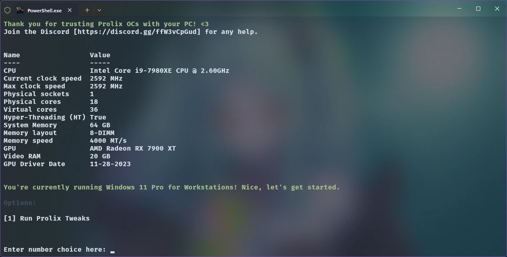
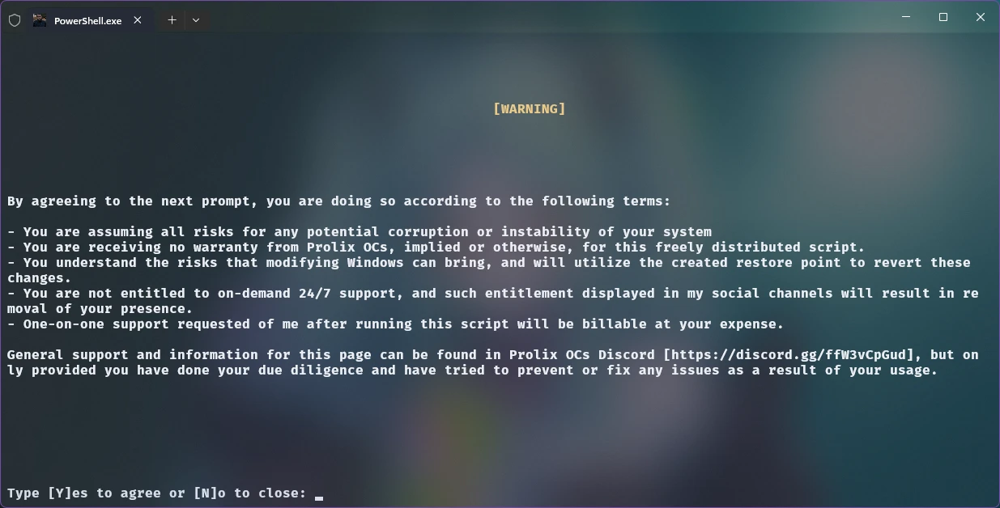

# 
Refyne - The One and Done Affair for Windows 11

</img>

"Refyne" is a script designed to refine your system fully for multitasking, gaming, programming, multimedia, and more.

**Designed for Windows 11.**

## Screenshots

## Usage
### 1. Right click the "Refyne.ps1" script, and select "Run with Powershell" in your context menu. 
This script is auto-elevating, meaning that when you run it, it will open Windows Terminal as an administrator.
### 2. Press "1" to start the optimization process.
More things will come, and it should be plainly obvious what to press if you want to use aforementioned things.
### 3. Agree to the terms presented by pressing Y/y. 
There will be two disclosures that need to be answered, this is not a fire and forget solution. If you don't agree with the terms presented, sorry. If you didn't read them and want to break the terms, sorry.
### 4. Reboot system when prompted. 
It is not recommended to continue to use your system until all of the tweaks have taken. 

Currently, there is no support for Windows 10 until I can port my existing Windows 10 script to this. 

## FAQ

- ### My system broke because of your script!
  - No it didn't. This script won't do any harm to your system, and if it adversely affects your performance: a restore point is forcibly created every time it is run. Use it. Not even mentioning, when you ran this script, you agreed that all liability falls on your shoulders.

- ### Windows 11 sucks! Where's the Windows 10 tweaks?
  - Firstly: it doesn't, you just hate things being different. Let's be real. Secondly: I am currently working on it. If you have a problem with this, then fork the project and do it yourself. This is open source, after all.

- ### Can I run this script on a machine older than 10 years old?
  - Possibly. I've tested this on machines dating back to 2010 with Windows 11 installed and saw no adverse affects. As a matter of fact, my father's ASUS gaming laptop with a 2nd gen i7 even saw substantial usability gains. Your mileage MAY vary though.

- ### I had an error, where can I go to get help?
  - You can file an issue on GitHub, or for more expedient support, you can head to [my Discord Server](https://discord.gg/ffW3vCpGud) to get real-time help. If no one's available to answer your question, please don't act entitled. 

- ### But (x) said your script sucks!
  - Great. I'm happy for them. I, and many others, know it doesn't.

- ### How can I contribute?
  - You can file a pull request, or reach out to me to discuss any potential tweaks you'd like to see added. I will review them with my fellow developer Luke and make the determination if it's valid. However, this script is fairly comprehensive as it is.

- ### Do you take tips?
  - Only if you're willing! I accept tips via PayPal, Stripe and Cash App. I will also force Luke to take a portion of these tips, somehow or some way.