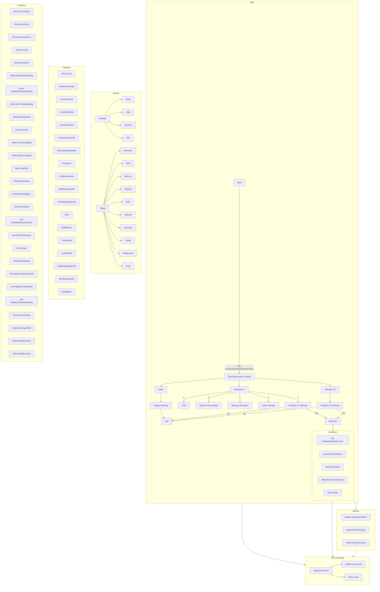

# 
 Refyne Main Execution Flow 

> [!NOTE]
> This is a control flow diagram of the main execution flow of the script. It is not a flowchart of the entire script. It is a high-level overview of the entire script. It does include all functions, variables, and enums used in the script.

---

**
© 2024 Refyne. All rights reserved. 
**
 

<a href="#">(Back to top)</a>

